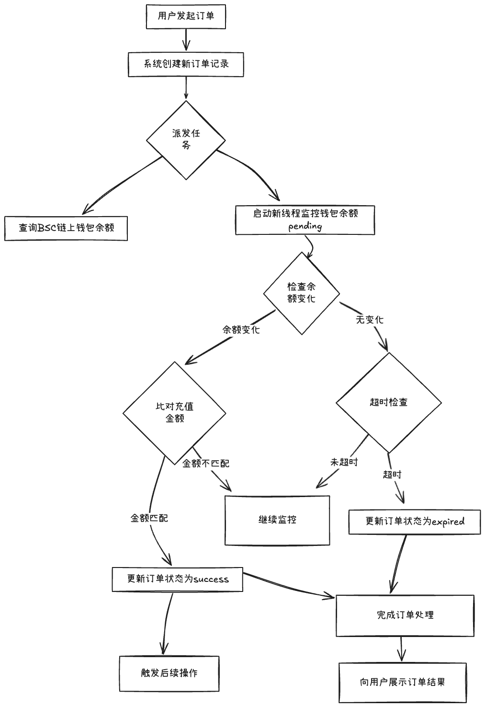
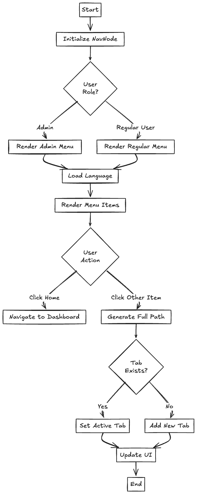
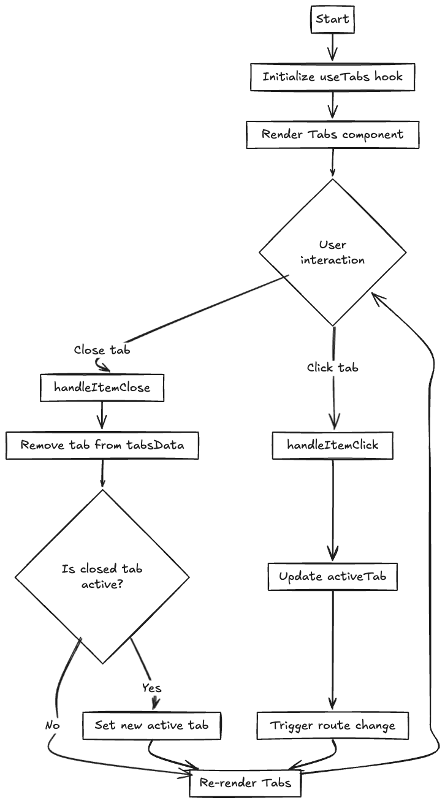

<div align="center">
<article style="display: flex; flex-direction: column; align-items: center; justify-content: center;">
    <p align="center"></p>
    <h1 style="width: 100%; text-align: center;">Cfans</h1>
    <p>
       一款基于next.js的社交媒体服务站。采用链上USDT收款，Telegram接收消息通知及管理订单。
    </p>
</article>
    
<div align="center">

[![LICENSE][license-badge]][license-url]
[![next.js][next-badge]][next-url]
[![Bot API][tg-badge]][tg-url]
[![Semi UI][semi-badge]][semi-url]
[![ethers][ethers-badge]][ethers-url]
[![Blog][blog-badge]][blog-url]
[](https://twitter.com/muyu_eth)
[](https://www.youtube.com/channel/UClhZUsoeyNF5kDZ-OO4y0sw)

[next-badge]: https://img.shields.io/badge/next.js-v14.2.15-blue
[next-url]: https://nextjs.org/
[tg-badge]: https://img.shields.io/badge/Bot%20API-v.7.4-00aced.svg?style=flat-square&logo=telegram
[tg-url]: https://core.telegram.org/bots/api
[semi-badge]: https://img.shields.io/badge/Semi_UI-v2.72.3-blue
[semi-url]: https://semi.design
[blog-badge]: https://img.shields.io/badge/Blog-web3-blue
[blog-url]: https://blog.muyuai.top/
[ethers-badge]: https://img.shields.io/badge/ethers-v6.13.4-blue
[ethers-url]: https://github.com/ethers-io/ethers.js
[license-badge]: https://img.shields.io/npm/l/@douyinfe/semi-ui
[license-url]: https://github.com/DouyinFE/semi-design/blob/main/LICENSE

</div>

</div>

# 技术栈

## Web2

- React.js
- Next.js (React 框架)
- Serverless (无服务器应用部署)
- Tailwind CSS (CSS 框架)
- semi-ui (UI 组件库)
- echarts (浏览器图表和可视化库)
- mongodb (数据库)
- auth.js (登陆认证)
- redux (状态管理)
- zustand (状态管理)
- ...

## Web3

- ethers (以太坊区块链库)
- bcryptjs (加密库)
- node-telegram-bot-api (Telegrame API 库)
- ...

# 🎉 优势

- 🚀 项目是完全开源免费的，完全遵守 MIT 开源协议
- 💪 支持链上支付,支持 Binance 交易所提现,实现 0 手续费
- 🌍 权限管理,后台管理用户、商品、Telegrame 管理, 订单状态、用户余额支持 Telegrame 机器人管理
- ⚙️ 重要参数通过本地 env 配置，其余个性化参数通过后台管理
- 🥳 异步队列响应，优雅及高性能
- 👏 支持 http api，其他系统亦可接入
- 💕 支持私有化部署，无需担心钱包被篡改和吞单
- 🎨 异步队列响应，优雅及高性能

# 🔥 项目结构(主要)

```
CFANS
├── README.md(说明文档)
├── src(核心目录 代码)
├── .env.example(自定义配置 所有参数必须 启动时删除.example)
├── .env.local.example(auth.js身份验证配置 集成Google、Github、TWITTER 启动时删除.example)
├── static(静态文件)
└── ...
```

# 📝 实现思路

## 链上支付流程



## 👍 导航栏



</div>

## ⚡️ 面包屑



# 🎨 本地调试

```
npm i

npm run dev
```

# 部署(视频讲解版)

# 预计未来发展

- 🚀 多链多钱包支持，计划增加 trx 以及支付宝、微信等（现因没有企业账号，暂时没对接，后续也可能对接三方个人免支付）
- 💪 发卡模块，再现基础上其实很容易实现
- 🌍 支付插件集成(重要程度较低，商业模式需要)
- 🥳 ...
